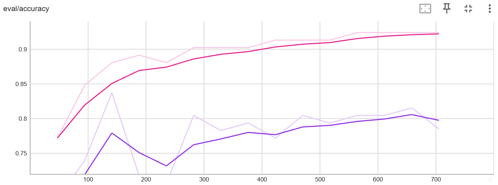
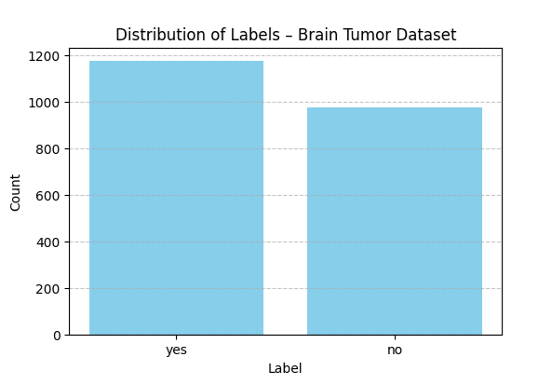
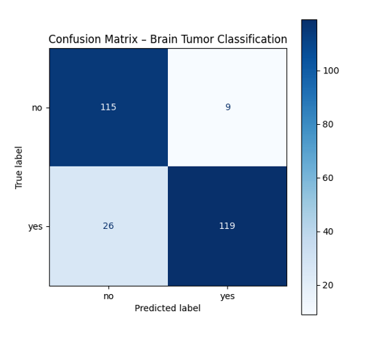
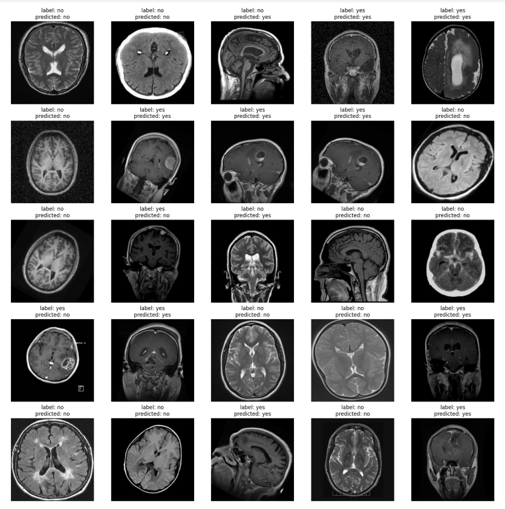

# Brain Tumor Classification

## 🧠 Projektbeschreibung
Dieses Projekt dient der Klassifikation von MRT-Bildern des Gehirns.
Ziel ist es, automatisch zu erkennen, ob auf dem Bild ein Hirntumor vorhanden ist oder nicht.

Ein Vision Transformer (ViT) wurde mit Hilfe von Transfer Learning auf einem augmentierten Datensatz trainiert. Zusätzlich wurde ein Zero-Shot-Modell evaluiert, um die Generalisierungsfähigkeit zu vergleichen.

Das finale Modell wurde auf Hugging Face veröffentlicht und kann öffentlich über eine Webanwendung getestet werden.

### 🔗 Name & URL
| Plattform       | URL |
|----------------|-----|
| Huggingface Space   | [Brain Tumor App (Gradio)](https://huggingface.co/spaces/Tharsana/brain-tumor-classifier) |
| Model Page          | [ViT Brain Tumor Model](https://huggingface.co/Tharsana/vit-base-brain-tumor) |
| GitHub Repository   | https://github.com/Jegattha/brain-tumor-classifier|

---
## Labels
Die Klassifikation erfolgt in folgende zwei Klassen:
- **brain tumor** (Hirntumor vorhanden)
- **no brain tumor** (kein Hirntumor)

## Zero-Shot-Prompts (für das CLIP-Modell verwendet)
- „An MRI scan showing a brain tumor“
- „An MRI scan showing a healthy brain“
---

## Datenquellen und verwendete Merkmale je Quelle

| Datenquelle         | Beschreibung                                                                 |
|---------------------|------------------------------------------------------------------------------|
| Brain Tumor Dataset | MRT-Bilddatensatz mit zwei Klassen: „yes“ (Tumor) und „no“ (kein Tumor). Die Bilder stammen aus öffentlich zugänglichen medizinischen Bildarchiven und wurden manuell in Ordnern strukturiert. https://www.kaggle.com/datasets/masoudnickparvar/brain-tumor-mri-dataset & https://www.kaggle.com/datasets/mohammadhossein77/brain-tumors-dataset?utm_source=chatgpt.com |
| Erweiterte Bilder   | Die Trainingsdaten wurden durch Datenaugmentation künstlich vergrößert. Dadurch stehen mehr Varianten pro Klasse zur Verfügung. |

## Datenaugmentation

| **Augmentation**                                                      | **Beschreibung**                                                                                                                                       |
| --------------------------------------------------------------------- | ------------------------------------------------------------------------------------------------------------------------------------------------------ |
| `Resize((224, 224))`                                                  | Skaliert jedes Bild auf eine feste Größe von **224×224 Pixeln**, passend zum ViT-Modell.                                                               |
| `RandomHorizontalFlip(p=0.5)`                                         | Spiegelt das Bild mit einer Wahrscheinlichkeit von **50 %** horizontal (links ↔ rechts).                                                               |
| `RandomRotation(20)`                                                  | Rotiert das Bild zufällig im Bereich von **±20 Grad** – z. B. leicht geneigte MRT-Aufnahmen.                                                           |
| `ColorJitter(brightness=0.2, contrast=0.2, saturation=0.2)`           | Verändert zufällig **Helligkeit, Kontrast und Farbsättigung** des Bildes um bis zu ±20 %.                                                              |
| `RandomAffine(degrees=0, translate=(0.05, 0.05), scale=(0.95, 1.05))` | Wendet eine **Affine-Transformation** an: verschiebt das Bild um bis zu **5 %**, skaliert es zufällig im Bereich **±5 %**. Keine zusätzliche Rotation. |

---

## Modelltraining

### Datenaufteilung (Train/Validation/Test)

Insgesamt wurden **3434 MRT-Bilder** verwendet, aufgeteilt in zwei Klassen:

- **1215 Bilder** ohne Hirntumor („no“)
- **1469 Bilder** mit Hirntumor („yes“)

Die Daten wurden folgendermaßen gesplittet:

- **80 %** für das Training  
- **10 %** für die Validierung  
- **10 %** für den Test  

| Split       | Anzahl Bilder |
|-------------|----------------|
| Train       | 2147           |
| Validation  | 268            |
| Test        | 269            |

---

## Training

| Epoche | Trainingsverlust | Validierungsverlust | Genauigkeit |
|--------|------------------|---------------------|-------------|
| 1      | 0.8264           | 0.6904              | 57.1 %      |
| 2      | 0.6692           | 0.5918              | 73.1 %      |
| 3      | 0.5584           | 0.5281              | 78.4 %      |
| 4      | 0.4993           | 0.4851              | 83.2 %      |
| 5      | 0.4554           | 0.4554              | 83.2 %      |
| 6      | 0.4237           | 0.4345              | 82.5 %      |
| 7      | 0.4035           | 0.4183              | 82.5 %      |
| 8      | 0.3861           | 0.4066              | 83.2 %      |
| 9      | 0.3793           | 0.3976              | 84.3 %      |
| 10     | 0.3678           | 0.3898              | 84.3 %      |
| 11     | 0.3665           | 0.3843              | 84.3 %      |
| 12     | 0.3564           | 0.3802              | 84.3 %      |
| 13     | 0.3518           | 0.3772              | 84.7 %      |
| 14     | 0.3508           | 0.3755              | 84.7 %      |
| 15     | 0.3518           | 0.3750              | **84.7 %**  |

---

## Evaluationsergebnisse (auf Testdaten)

Nach Abschluss des Trainings wurde das Modell auf dem Test-Set evaluiert:

- **Eval Loss**: 0.3678  
- **Accuracy**: 86.99 %  
- **Evaluierungszeit**: 1.72 Sekunden  
- **Samples pro Sekunde**: 156.02  
- **Evaluierungs-Epoche**: 15

> Das Modell zeigte eine solide Generalisierungsleistung mit einer Testgenauigkeit von fast 87 %. Dies bestätigt die Stabilität des Trainings über 15 Epochen.

---
### TensorBoard

Details of training can be found at [Huggingface TensorBoard](https://huggingface.co/Tharsana/vit-base-brain-tumor/tensorboard)

| Model/Method                                                         | TensorBoard Link                                      |
|----------------------------------------------------------------------|------------------------------------------------------|
| Transfer Learning with `google/vit-base-patch16-224` (without data augmentation) | runs/May24_08-53-04_ip-10-192-11-87                   |
| Transfer Learning with `google/vit-base-patch16-224` (with data augmentation)  | runs/May24_08-24-33_ip-10-192-11-87               |

---
### 📊 Ergebnisse

| Modell/Methode                                                               | Accuracy   | Precision | Recall  |
| ---------------------------------------------------------------------------- | ---------- | --------- | ------- |
| Transfer Learning mit `google/vit-base-patch16-224` (ohne Data Augmentation) | 78.49 %    | –         | –       |
| Transfer Learning mit `google/vit-base-patch16-224` (mit Data Augmentation)  | 92.39 %     | –         | –       |
| Zero-Shot Image Classification mit `openai/clip-vit-large-patch14`           | 87.70 %    | 88.53 %   | 87.70 % |

---

### References

### 📉 Confusion Matrix

**🧠 Interpretation**

True Positives (119): Hirntumor korrekt erkannt.

True Negatives (115): Gesunder Fall korrekt erkannt.

False Positives (9): Gesunde Fälle fälschlich als Tumor erkannt 

False Negatives (26): Tumorfälle fälschlich als gesund eingestuft 

**show predictions**

---

## 📁 Beispielbilder

Beispielbilder liegen im Ordner `/example_images/` und werden in der Gradio App angezeigt.  
Sie enthalten sowohl Tumor- als auch Nicht-Tumor-Bilder aus dem Testset.

---

## Fazit

✅ Mein Modell ist nicht overfitted:
Die Trainingsgenauigkeit ist nicht künstlich hoch im Vergleich zur Validierung.

Loss & Accuracy sind im Training ähnlich wie bei Validation & Test.

Kein typischer Fall von: „Train=0.99, Val=0.78“ → das wäre Overfitting.

✅ Mein Modell ist auch nicht underfitted:
Accuracy liegt klar über dem Zufallswert (~50 % bei binärer Klassifikation).

Der Loss sinkt deutlich, also hat das Modell gelernt.

Augmentierung + guter Datensatzumfang sorgen für stabile Ergebnisse.

🎯 Mein Modell ist sehr gut ausbalanciert.
Es zeigt ein gesundes Lernverhalten – also kein Overfitting, kein Underfitting.

Check out the configuration reference at https://huggingface.co/docs/hub/spaces-config-reference
